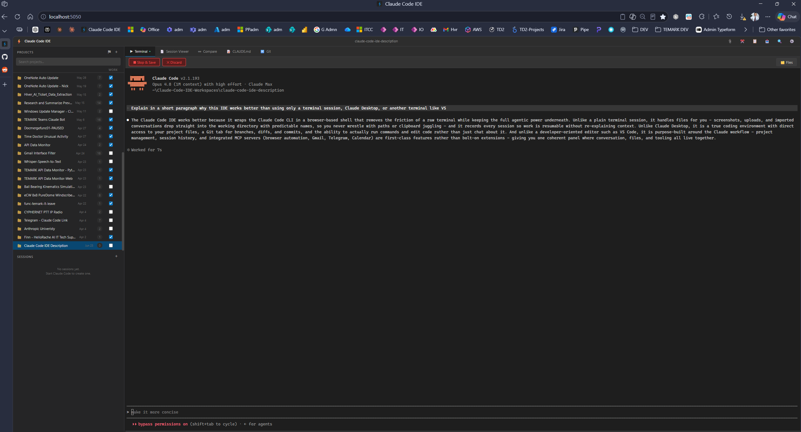

# ⚡ Claude Code IDE
A full-featured local web IDE that wraps Claude Code's CLI with real-time terminal emulation, project/session management, file processing, and MCP integration. Built entirely in Python and vanilla JavaScript — no frameworks, no Electron, no cloud dependencies.

This is not a thin wrapper or a chat UI that calls an API. It manages real PTY processes, streams bidirectional I/O over WebSockets, renders raw terminal output through a virtual terminal emulator, and extends Claude Code's capabilities through a custom MCP tool server.




## What It Does

- **Interactive Terminal** — Runs Claude Code in a real terminal (xterm.js) inside your browser
- **Multi-Session Tabs** — Run up to 8 concurrent Claude Code sessions in a tab strip, each with its own PTY process, project binding, and status dot; switch, stop, save, or discard them independently
- **Needs-Input Notifications** — When Claude is waiting on you in a session you aren't watching, the tab gets an orange pulsing dot, the page title and favicon get a badge, and an OS toast plus a subtle chime fire (all configurable); powered by Claude Code's native Notification hook with a one-click installer
- **Editor Pane** — A deliberately unobtrusive Monaco editor slides in from a slim `<` handle on the terminal's right edge: compact file tree, open-file tabs with dirty indicators, Ctrl+S save, changed-on-disk conflict guard, capped at half the window, remembered per session tab
- **Refresh Survival** — Reloading the page (or accidentally closing it) no longer kills running sessions: the server keeps them alive for a grace period and the page reattaches on load, screen intact
- **Paste-Image** — Ctrl+V an image from the clipboard straight into a session: it lands in the project directory and Claude is prompted to analyze it
- **Usage Dashboard** — Token consumption per project and per day, parsed from Claude Code's own transcripts with 7/30-day and all-time summaries
- **Session Recording** — Every conversation is automatically captured and cleaned via virtual terminal rendering (pyte)
- **Session Resume** — Resume any saved session using Claude Code's native `--resume` flag
- **Project Organization** — Group related sessions into named projects with custom working directories
- **Session Viewer** — Browse and read past conversations with clean, readable transcripts
- **Session Export** — Download transcripts as `.md` or `.txt` files
- **CLAUDE.md Editor** — Read, edit, and save CLAUDE.md project instructions directly in the IDE
- **File Upload** — Upload files (Excel, Word, images, etc.) to the project directory for Claude to read via MCP tools
- **Screenshot Capture** — One-click Windows Snipping Tool integration: capture a screen region and Claude analyzes it automatically
- **Conversation Import** — Paste text from claude.ai, ChatGPT, email, or any source into a modal; saved as a file and Claude picks up where it left off
- **Quick-Resume** — Hover any project to one-click resume the most recent session
- **Pin Projects** — Right-click to pin frequently used projects to the top of the sidebar
- **Archive Projects** — Right-click a project to archive it: the project (with all its sessions) moves out of the sidebar into `data/archived_projects/`. A 🗃️ button in the sidebar header opens the archived list, where any project can be restored with one click
- **Work/Personal Filter** — Right-aligned "Work" checkbox column in the sidebar with a header toggle that cycles All (⚑) → Work only (💼) → Personal only (🏠)
- **Most-Recent-First Sort** — Projects are ordered by the timestamp of their most recent session (pinned projects still float to the top)
- **Project Search** — Search box below the PROJECTS header filters the project list by name in real time (Esc clears)
- **Live URLs** — Per-project list of live URLs (production, staging, localhost, etc.); a 🌐 button next to the Git tab opens the URL or shows a dropdown when more than one is configured
- **Copy Session UUID** — Right-click any session in the sidebar and pick *Copy UUID* to copy its Claude Code session ID to the clipboard
- **File Tree** — Toggle a file explorer panel alongside the terminal showing the project's working directory with path display; click any file to ask Claude to read it
- **Git Integration** — Dedicated Git tab showing branch, changed files, recent commits, and full color-highlighted diffs; initialize new repos from the UI; open the repo on GitHub with one click (with a chooser when the project pushes to multiple repos) and read the project's README rendered right in the tab
- **Timestamps** — Projects and sessions display their creation date and time in the sidebar
- **Search** — Full-text search across all saved sessions (Ctrl+Shift+F)
- **Settings** — Configurable Claude Code command, default project, and terminal font size
- **Context Menus** — Right-click projects to rename, delete, set working directory, or pin; right-click sessions to rename, delete, or move to another project
- **Import External Sessions** — Pull in any Claude Code session from outside the IDE by selecting from a list or pasting a UUID; creates a new project with the session immediately resumable
- **Session UUID Display** — View and copy session UUIDs from the session viewer toolbar for use with `claude --resume` outside the IDE
- **Auto-Generated CLAUDE.md** — New projects get a minimal CLAUDE.md with project name, description, and working directory (IDE-level instructions live in the global `~/.claude/CLAUDE.md`)
- **Permission Mode** — Status bar dropdown below the terminal with five modes: Default (uses the `defaultMode` from your own Claude Code settings.json), Ask Permissions, Auto Accept Edits, Plan Mode, and Bypass Permissions. The selection is remembered across page reloads and applies to the next session you start or resume - changing it while a session is running shows a reminder toast (use Shift+Tab inside the terminal to switch a live session). Note that Auto Accept Edits only auto-approves file edits; other actions like shell commands still prompt, which is Claude Code's own behavior for that mode
- **Open in Explorer** — Click the folder icon in the file tree header to open the project's working directory in your system file manager
- **Clipboard Support** — Terminal copy that actually works: drag over text in a running Claude session and it lands in the real Windows clipboard (OSC 52 bridge), drag-select auto-copies outside the TUI, Ctrl+C copies selections, Ctrl+V pastes without double-paste issues, and every copy shows a confirming toast
- **Kill Server** — Stop the IDE server from within the Settings modal when you need to restart
- **Automatic Backups** — On every startup, zips project data locally (keeps 10 snapshots) and pushes to a private GitHub repo for off-site recovery
- **Non-Blocking Git** — Git operations run in a thread pool with hard timeouts so the server never locks up
- **Smart Defaults** — New projects auto-fill a dedicated working directory (`~/Claude-Code-IDE-Workspaces/<project-name>`)
- **Tooltips** — Hover hints on every interactive element
- **In-App Guide** — A ❓ button in the title bar opens this README rendered right inside the IDE, so the docs always match the running version
- **Multi-Account** — A 👤 status-bar selector switches which Anthropic account new sessions run under (each account = its own config directory); run different accounts simultaneously in different tabs and flip over when one hits its usage limit
- **Dark Theme** — VS Code-inspired dark UI

## What's New: Phases 20-27

The last eight development phases turned the IDE from a single-session recorder into a parallel workbench. In order:

### Phase 20 — Terminal copy that finally works (OSC 52 clipboard bridge)

Copying text out of a running Claude Code session in the browser was silently broken, and the root cause was subtle: Claude Code's TUI enables any-motion mouse tracking, so drag-selections never reach xterm.js at all — the TUI draws its **own** highlight and "copies" by emitting an **OSC 52** escape sequence (`ESC ]52;c;<base64>`). Real terminals like Windows Terminal translate that into a system clipboard write; xterm.js ignores it, so Claude reported "copied N chars to clipboard" while the Windows clipboard stayed empty. The IDE now registers an OSC 52 handler that decodes the payload and writes the real clipboard — dragging over text in a session just works, with a confirming toast. Outside the TUI (welcome screen, plain shell) drag-select auto-copies, with the selection captured at event time because mouse-motion reports clear xterm selections within milliseconds. Copy failures surface as visible toasts instead of silence. The same phase hardened permission modes: a missing `permission_mode` field now falls back to sending no CLI flags, so your own `settings.json` `defaultMode` always wins.

### Phase 21 — Multi-session tabs

One page, many Claude Code sessions. The server keys terminals by `terminal_id` instead of socket connection, every WebSocket event carries the id, and disconnects kill and auto-save all terminals a page owned. The frontend replaces its single-terminal globals with a session map: a tab strip above the terminal hosts up to 8 concurrent sessions, each with its own xterm instance, green/gray running dot, and project label. A tab captures its project from the sidebar **at spawn time**, so you can browse other projects freely while sessions run — the old "stop your session before switching projects" guard is gone (session saves were already routed by working directory, not sidebar state). Resume and Quick-Resume open in a new tab instead of offering to kill the running one, and starting two sessions in the same working directory warns about file-conflict risk.

### Phase 22 — Needs-input notifications

Parallel sessions need a way to say "I'm waiting on you." Claude Code's native **Notification hook** fires exactly when a session needs attention (permission request, question, idle prompt); the IDE offers a one-click install that adds the hook to `~/.claude/settings.json` (with a backup, refusing to touch an unparsable file). The hook pipes its event JSON to `POST /api/notify`, which matches the session id to the owning tab and pushes it over Socket.IO. Delivery: orange pulsing dot on the session tab, a "(n)" page-title counter, a badged favicon — and when you aren't watching that session, an OS toast (click it to jump to the tab) plus a subtle two-note WebAudio chime. Attention clears the moment you focus the tab or type into the session. An idle-stream heuristic (sustained output, then silence) gives a dot-only fallback for sessions without the hook. Live testing surfaced two classic pitfalls, both fixed: the silent heuristic could pre-empt the hook's audible alert (alerts now escalate), and Chrome's autoplay policy silently suspends an AudioContext created while the window is unfocused (the audio engine now unlocks on the first user gesture, and Save Settings plays the chime as an audible check).

### Phase 23 — The unobtrusive editor pane

Not a headline editor — a quick-edit surface that stays out of the way. A slim `<` handle on the terminal's right edge slides in a **Monaco** pane (lazy-loaded from CDN on first open, one shared instance); `>` tucks it away. Each session tab remembers its own pane state — open/closed, open files, active file — and the pane is drag-resizable up to a hard cap of 50% of the window. Inside: a compact toggleable file tree, open-file tabs with dirty dots, Ctrl+S save, VS Code dark theme. Because Claude edits the same files you do, saves carry the file's load-time mtime and a mismatch returns 409: you choose overwrite or reload, never a silent clobber. The backing endpoints (`GET`/`PUT /api/projects/<name>/file`) are traversal-guarded to the project working directory, detect binary files, and cap at 2 MB.

### Phase 24 — Sessions survive a page refresh

Previously, any disconnect killed every running session — an accidental F5 could cost you eight of them. Now a disconnect only *orphans* terminals: the server keeps the PTYs alive for a grace period (default 90s, `CLAUDE_IDE_ORPHAN_GRACE`), and a freshly loaded page reattaches to them — same terminal, same process, screen restored via output replay plus a resize nudge that makes the TUI repaint itself. If nobody comes back in time, the session auto-saves and shuts down exactly as before. (A "changes this session" review panel was considered for this slot and deliberately skipped: git plus restore-point tags already cover that need.)

### Phase 25 — Paste an image, Claude sees it

Ctrl+V with an image on the clipboard (say, a screenshot you just took) saves it into the tab's project directory as `pasted_image_<timestamp>.png` and prompts Claude to analyze it. Text pastes behave exactly as before.

### Phase 26 — Usage dashboard

A 📊 Usage tab reads token consumption straight from Claude Code's own transcripts, matched to IDE sessions: summary cards for the last 7 days, 30 days, and all time; a 30-day output-token bar chart; and a per-project table. Streamed responses repeat usage per message id, so entries are deduplicated before summing, and parsed totals are cached by file mtime so only new activity is ever re-read.

### Phase 27 — Multiple Anthropic accounts, and what things cost

For people with two (or more) Claude accounts: a 👤 selector in the terminal status bar picks which account the next session spawns under, so when one account hits its daily usage limit you flip to the other and keep working. Each account maps to its own `CLAUDE_CONFIG_DIR` — add it in Settings, start a session under it, run `/login` once, done. Different accounts can run **simultaneously** in different tabs, resumes always use the session's original account (its transcript lives in that account's config dir), and the server refuses to open the same session in two tabs (two processes must never write one conversation transcript). The Usage tab gained estimated cost — per-model token buckets priced from a built-in table (overridable in settings.json), shown on the cards, the project table, and a new BY ACCOUNT table that attributes usage and cost to the account that ran each session. Rounding out the phase: session tabs are labeled by session UUID (several tabs on one project were indistinguishable), an ❓ in-app Guide renders this README inside the IDE so the docs always match the running version, and `start-ide.bat` no longer auto-opens a browser on every launch — the accumulated windows were the root cause of duplicate-session races.

## How It Works Under the Hood

This project solves several non-trivial engineering problems:

### Real PTY Process Management
The server spawns Claude Code as a real pseudo-terminal process (`pywinpty` on Windows, `pty` on Unix), not a subprocess with piped stdio. This gives Claude Code a fully interactive terminal environment — cursor movement, color output, line editing, and TUI rendering all work correctly. The PTY output is streamed in real time over WebSocket to xterm.js in the browser, and user keystrokes flow back the other direction.

### Virtual Terminal Rendering for Clean Transcripts
Raw PTY output is full of ANSI escape sequences — cursor movements, screen clears, color codes, character-by-character streaming, spinner animations, and screen overwrites. Simple regex stripping produces garbled text with missing spaces and words running together. Instead, the entire raw output is replayed through **pyte**, a Python virtual terminal emulator that maintains a full screen buffer and scrollback history. The result is a clean, readable transcript that accurately represents what the user actually saw on screen.

### Native Session Resume
Rather than trying to inject previous conversation context into a new session (which breaks Claude Code's TUI and has timing issues), the IDE uses Claude Code's own session management. Each session is started with `--session-id <uuid>`, and resuming uses `--resume <uuid>`. Claude Code restores the full conversation context natively, including tool call history and system prompts that aren't visible in the transcript.

### MCP Tool Integration
The IDE works with a companion [Browser & File MCP Server](https://github.com/Powellga/Claude_Browser_MCP_Server) that exposes 25 tools — 18 for browser automation (Playwright) and 7 for file processing (Excel, Word, PowerPoint, CSV, images). The file upload button in the IDE drops files into the project's working directory and auto-prompts Claude to read them. Claude Code discovers and connects to the MCP server automatically via its config — the IDE doesn't need to broker the connection.

### Screenshot Capture Pipeline
The screenshot button launches Windows Snipping Tool in capture mode (`snippingtool /clip`), then polls the system clipboard via `PIL.ImageGrab.grabclipboard()` for up to 30 seconds waiting for the captured image. Once detected, it saves the image as a timestamped PNG to the project's working directory and auto-prompts Claude to analyze it. The clipboard is cleared before launching the tool so stale images aren't picked up. The entire flow — launch tool, detect capture, save file, prompt Claude — happens from a single button click.

### Working Directory Persistence
Each project has a configurable working directory. When you start a session, the PTY process spawns in that directory. The directory path is saved with every session record, so resumed sessions return to their original location even if the project config changes later. If the specified directory doesn't exist at project creation time, the IDE prompts to create it.

## Requirements

This IDE **wraps** the Claude Code CLI - it does not replace it. You need these installed *before* the IDE will run:

| Prerequisite | Required? | Notes |
|---|---|---|
| **Python 3.10+** | Required | Backend is Flask + Python |
| **Claude Code CLI** | Required | `npm install -g @anthropic-ai/claude-code` - must be on PATH (verify with `claude --version`) |
| **Windows 10/11** | Recommended | Primary target (UAC elevation, `pywinpty`/ConPTY). Unix/macOS run with reduced terminal fidelity |
| **Admin rights** | Required (Windows) | The app self-elevates via UAC on startup so sessions get the access Claude Code needs |
| **MCP servers** | Optional | Needed only for file-upload, screenshots, Telegram, Gmail - see [MCP Servers](#mcp-servers-browser-telegram-gmail) |

## Quick Start

First confirm the prerequisites above are in place (`claude --version` should work).

### 1. Set Up Environment

```powershell
# Clone and enter the project
git clone https://github.com/Powellga/Claude-Code-IDE.git
cd Claude-Code-IDE

# Create and activate a virtual environment
python -m venv .venv
.\.venv\Scripts\Activate

# Install dependencies (requirements.txt includes pywinpty on Windows)
pip install -r requirements.txt
```

### 2. (Optional) Configure MCP Servers

For file-upload, screenshots, Telegram, or Gmail support, copy the template and fill in your own paths/credentials (see [MCP Servers](#mcp-servers-browser-telegram-gmail) for details):

```powershell
copy .mcp.json.example .mcp.json
```

Skip this step to run the IDE with the core terminal/session features only.

### 3. Run the IDE

```powershell
# Either run directly:
python app.py

# ...or use the launcher (runs a data backup first, then starts):
.\start-ide.bat
```

Then open **http://localhost:5050** in your browser.

**Note:** The IDE automatically requests admin privileges on startup.
If you see a UAC prompt, click Yes — this ensures all Claude Code
sessions have the elevated access needed for system-level tasks.

### 4. Use It

1. Click **+ New Project** in the sidebar to create a project (optionally set a working directory)
2. Select the project in the sidebar
3. Click **Start Claude Code** to open an interactive session — the **+** in the session tab strip opens more (up to 8 concurrent, each tab labeled with its session UUID)
4. When you're done, click **Stop & Save** to save the session with a summary and tags
5. Browse past sessions in the sidebar, or use **Ctrl+Shift+F** to search
6. Click a saved session to view it, then **Resume** to continue where you left off (a session already open in another tab is switched to, never duplicated)
7. Use the **CLAUDE.md** tab to edit project instructions, the **Git** tab for status/diffs/README/Open Repo, and the **Usage** tab for token and cost tracking
8. Click the **📎 upload button** to upload files for Claude to analyze via MCP tools
9. Click the **✂️ screenshot button** to capture a screen region — Claude will analyze it automatically
10. Click the **📋 import button** to paste a conversation from another source — Claude continues from it
11. Click **❓** for the in-app guide, and **⚙️** for settings (including extra Anthropic accounts)

## Tabs

| Tab | Purpose |
|-----|---------|
| **Terminal** | Live Claude Code sessions with full PTY emulation. A session tab strip lets you run up to 8 concurrent sessions side by side - each tab is its own Claude process bound to the project selected when it started. A slim `<` handle on the right edge opens a per-tab Monaco editor pane (collapsed by default, capped at half the window) for quick manual edits without leaving the IDE |
| **Session Viewer** | Read saved transcripts, export as .md/.txt, or resume |
| **CLAUDE.md** | Edit project instructions file (Ctrl+S to save) |
| **Git** | Branch info, changed files, recent commits, and color-highlighted diffs; 🌐 Open Repo button (chooser when the project pushes to multiple repos) and a 📖 README viewer with rendered markdown |
| **Usage** | Token usage dashboard: 7/30-day and all-time summary cards, a daily output-token bar chart, and a per-project table - parsed from Claude Code's own transcripts and cached |

## Architecture

```
Browser (localhost:5050)
    |
    v  WebSocket (Socket.IO) + REST API
    |
Flask Server (Python)
    |
    +---> PTY Processes (pywinpty / pty) — one per session tab, up to 8,
    |         |                            keyed by terminal_id
    |         v
    |     Claude Code CLI  --Notification hook--> POST /api/notify
    |         |
    |         v  MCP Protocol (stdio)
    |         |
    |     Browser & File MCP Server
    |         |
    |         +---> Playwright (browser automation)
    |         +---> openpyxl / python-docx / python-pptx / Pillow (file processing)
    |
    +---> pyte (virtual terminal emulator — transcript cleaning)
    |
    +---> JSON file storage (projects, sessions, settings)
```

Everything runs locally. No cloud services, no databases, no containers. The browser is just the UI. Claude Code connects to any configured MCP servers automatically.

## File Structure

```
claude-code-ide/
├── app.py              # Flask server, WebSocket handlers, PTY management, REST API
├── backup.py           # Backup system (local zips + GitHub push, restore CLI)
├── start-ide.bat       # Launcher (admin elevation, backup on startup, launch server)
├── requirements.txt    # Python dependencies (flask, flask-socketio, pywinpty, pyte)
├── templates/
│   └── index.html      # Single-page app layout (tabs, modals, panels)
├── static/
│   ├── css/
│   │   └── style.css   # Dark theme (CSS custom properties, no preprocessor)
│   └── js/
│       └── app.js      # Frontend logic (vanilla JS, no framework)
├── conpty_process.py   # EXPERIMENTAL: direct ConPTY fallback (not used by app.py)
├── rebuild_jsonl.py    # Utility: rebuild a pruned Claude Code .jsonl so --resume works again
├── backups/            # Local zip snapshots (auto-pruned, last 10 kept)
└── data/
    ├── settings.json          # IDE settings (persisted across restarts)
    ├── projects/              # Project configs + session JSON files
    └── archived_projects/     # Archived projects (hidden from the sidebar, restorable)
```

## Configuration

### Settings Modal (gear icon)

| Setting | Description |
|---------|-------------|
| **Claude Code Command** | CLI command to launch Claude Code (e.g. `claude`, or a full path) |
| **Default Project** | Auto-select this project on startup |
| **Terminal Font Size** | Adjustable 10-24px, applied immediately |
| **Desktop notifications** | OS toast + orange tab dot when Claude needs your input and you aren't watching that session (powered by a Claude Code Notification hook the IDE offers to install) |
| **Notification sound** | Short two-note chime alongside the desktop notification |

### Environment Variables

| Variable | Default | Description |
|----------|---------|-------------|
| `CLAUDE_IDE_DATA` | `./data` | Where projects and sessions are stored |
| `CLAUDE_IDE_SHELL` | `powershell.exe` | Shell to use (auto-detects OS) |
| `CLAUDE_IDE_CMD` | `claude` | Command to launch Claude Code |
| `CLAUDE_IDE_SECRET` | (dev key) | Flask secret key |

### MCP Servers (Browser, Telegram, Gmail)

The IDE drives Claude Code, which connects to **MCP servers** for browser automation, file processing, Telegram, and Gmail. These server definitions are **not committed** to git - they contain machine-specific paths and personal secrets (e.g. Telegram API credentials). The repo ships a template instead.

**Setup:**

1. Copy the template to create your local config:
   ```powershell
   copy .mcp.json.example .mcp.json
   ```
2. Install the companion MCP servers you want (see **Companion Projects** below), then edit `.mcp.json`:
   - Replace each `C:/path/to/...` with the real path to that server on **your** machine.
   - For **Telegram**, set `TELEGRAM_API_ID` / `TELEGRAM_API_HASH` to your own values from https://my.telegram.org.
   - For **Gmail**, complete that server's own OAuth flow (its tokens stay local).
3. Start the IDE. On first use, Claude Code **prompts you to approve** each MCP server before it runs.

**Security:** `.mcp.json` is git-ignored, so your paths and secrets are never committed. The template holds only placeholders, and every user authenticates with **their own** accounts - downloading this repo gives you no access to anyone else's Telegram, Gmail, or browser session. The `browser` server is required for the IDE's file-upload and screenshot features; `telegram` and `gmail` are optional.

## Keyboard Shortcuts

| Shortcut | Action |
|----------|--------|
| Mouse drag | Copy terminal text to clipboard. While Claude Code is running, its TUI owns the selection ("copied N chars to clipboard") and the IDE bridges it to the real clipboard via OSC 52; otherwise a normal xterm selection is auto-copied |
| `Ctrl+C` | Copy selection if one exists, otherwise sent to the terminal (SIGINT) |
| `Ctrl+V` | Paste clipboard into the terminal |
| `Ctrl+Shift+F` | Open search |
| `Ctrl+S` | Save CLAUDE.md (when that tab is active) or the active file in the editor pane (when Monaco is focused) |
| `Escape` | Close modals |
| Right-click | Context menu on projects (rename, archive, delete, pin, set working directory, live URLs) and sessions (rename, move, copy UUID, delete) |

## Roadmap

- [x] Phase 1: Interactive terminal in browser (xterm.js + WebSocket + PTY)
- [x] Phase 2: Session recording and viewer (raw capture + pyte transcript cleaning)
- [x] Phase 3: Project management (CRUD, working directories, sidebar navigation)
- [x] Phase 4: Session resume (Claude Code native `--session-id` / `--resume` flags)
- [x] Phase 5: Session diffing, export, and CLAUDE.md editor
- [x] Phase 6: Settings, file upload, context menus, tooltips, working directory persistence
- [x] Phase 7: Screenshot capture, conversation import, sidebar timestamps, favicon/branding, launcher script
- [x] Phase 8: Quick-resume, pin projects, file tree viewer, git diff integration
- [x] Phase 9: Session move, set working directory, auto-fill workspace paths, file tree path display, git init
- [x] Phase 10: Import external Claude Code sessions, auto-generated CLAUDE.md for new projects, file path prompt fixes
- [x] Phase 11: Session UUID display with copy, Ctrl+C/V clipboard fix, kill server button
- [x] Phase 12: Automatic backup system (local zips + GitHub push), non-blocking git operations via thread pool
- [x] Phase 13: Minimal CLAUDE.md template, open-in-Explorer button, fix resumed sessions always using project working directory
- [x] Phase 14: Permission mode status bar (ask permissions, auto accept edits, plan mode, bypass permissions), fix session resume using session's original working directory
- [x] Phase 15: Wider sidebar, work-related project flag with right-aligned checkbox column and filter toggle, project list sorted by most recent session
- [x] Phase 16: Project search bar, per-project live URLs with tab-bar navigate button (single URL or dropdown), Copy UUID context menu on sessions
- [x] Phase 17: Sessions auto-routed to the correct project on save based on the session's working directory (no more drift from sidebar selection); project-switch blocked while a terminal is running
- [x] Phase 18: Project archiving (archive/restore with dedicated modal), three-state work/personal filter, and a bug-fix pass: repaired the Compare tab (parameter mismatch), git repo detection, non-ASCII git diffs, Plan mode CLI flag, duplicate-project metadata overwrite, corrupt project.json crash, and session-highlight in the sidebar; consolidated all project metadata I/O into UTF-8-safe helpers
- [x] Phase 19: Permission mode overhaul - selection persists across page reloads (was silently resetting to Auto Accept Edits), new Default mode that sends no CLI flags so the user's settings.json `defaultMode` is no longer overridden, Ask Permissions now maps to `--permission-mode manual`, and a toast notice that mode changes apply to the next session (Shift+Tab switches a live one)
- [x] Phase 20: Terminal copy finally works - OSC 52 clipboard bridge (Claude Code's TUI captures the mouse and "copies" selections via OSC 52, which xterm.js ignores by default; the IDE now decodes it and writes the real Windows clipboard), copy-on-select with toast when the TUI isn't capturing the mouse, visible copy-failure toasts, hidden-textarea fallback for non-secure origins, cache-busted app.js, and missing permission_mode now falls back to Default instead of forcing prompts
- [x] Phase 21: Multi-session tabs - run up to 8 concurrent Claude Code sessions in a tab strip inside the Terminal panel. Terminals are keyed by terminal_id instead of socket connection (one page, many PTYs), every WebSocket event carries the id, each tab owns its own xterm instance and captures its project at spawn time, resume/quick-resume open in a new tab instead of stopping the running one, the project-switch guard is gone (save routing is already working-directory-based), disconnect auto-saves all running tabs, and a warning appears when two running tabs share a working directory. Frontend degrades gracefully to single-tab mode against a pre-Phase-21 server
- [x] Phase 22: Needs-input notifications - Claude Code's native Notification hook POSTs to /api/notify (the IDE offers a one-click install of the hook into ~/.claude/settings.json, with backup); the event routes to the owning session tab as an orange pulsing dot, a "(n)" title counter, and a badged favicon, plus an OS toast and subtle chime when you aren't watching that tab. Attention clears when you focus the tab or type into the session. An idle-stream heuristic (busy burst then 4s of silence) provides a dot-only fallback for sessions without the hook. Settings toggles for notifications and sound. Hook alerts escalate a flag the silent heuristic set first (instead of being swallowed by it), and the WebAudio context is unlocked on the first user gesture so the chime can play while the window is unfocused (Chrome autoplay policy); Save Settings plays the chime as an audible confirmation
- [x] Phase 23: Collapsible Monaco editor pane - a deliberately unobtrusive, per-session-tab editor: a slim `<` handle on the terminal's right edge slides in Monaco (lazy-loaded from CDN, one shared instance) with a compact file tree, open-file tabs with dirty dots, Ctrl+S save, and drag-resize capped at 50% of the window. Each session tab remembers its own pane state (open files, active file, open/closed). Saves are guarded by an mtime check: if the file changed on disk since it was opened (e.g. Claude edited it), you choose overwrite or reload instead of silently clobbering. Backend gains traversal-guarded GET/PUT /api/projects/&lt;name&gt;/file endpoints with binary detection and a 2 MB cap
- [x] Phase 24: Session survival across page refresh - disconnecting no longer kills sessions. Terminals are orphaned with a grace timer (default 90s, `CLAUDE_IDE_ORPHAN_GRACE`); a freshly loaded page asks `GET /api/active-terminals` and reattaches via a `reattach_terminal` event that rebinds the socket, replays the output tail, and repaints the TUI with a resize nudge. Reader threads route output to the terminal's CURRENT socket, so ownership follows the reattach. If nobody reattaches within the grace period, the session auto-saves and shuts down exactly as before. An accidental F5 (or a frontend update) no longer costs you eight running sessions. (The originally planned "changes this session" review panel was deliberately skipped - git plus restore-point tags already cover it)
- [x] Phase 25: Paste-image into the terminal - Ctrl+V with an image on the clipboard (e.g. a fresh screenshot) saves it into the tab's project directory as `pasted_image_YYYYMMDD_HHMMSS.png` and prompts Claude to analyze it; text pastes keep working exactly as before. (Full-text transcript search was already in place via Ctrl+Shift+F, so this phase was smaller than planned)
- [x] Phase 26: Usage dashboard - a 📊 Usage tab showing token consumption parsed from Claude Code's own jsonl transcripts, matched to IDE sessions by claude_session_id. Summary cards for the last 7 days / 30 days / all time (output plus input+cache and turn counts), a 30-day output-token bar chart, and a per-project table sorted by output. Streamed responses repeat usage per message id, so entries are deduplicated before summing; parsed totals are cached by file mtime+size in data/usage_cache.json so only new activity is re-read (the first scan is slow, after that it is quick). Tokens rather than dollars - pricing tables go stale, token counts don't
- [x] Transcript readability fix: the pyte virtual screen used for cleaning was hardcoded to 120 columns, so output from wider terminals was clipped at the boundary and wrapped into shredded fragments in the Session Viewer. Sessions now record their terminal size on resize and are cleaned at that exact width (generous 240-column default for older records - cleaning happens at view time, so old sessions benefit too), and consecutive duplicate lines from TUI redraws are collapsed
- [x] Compare tab removed, Git tab upgraded: session-to-session diffing never answered a real question (two conversations diff as "everything changed"), so it is gone - one less tab competing for attention. The Git tab gained a 🌐 Open Repo button that opens the repository on GitHub (with a chooser when the project pushes to more than one repo, e.g. a personal and an org remote) and a 📖 README button that renders the project's README.md right in the tab (marked + DOMPurify, lazy-loaded from CDN)
- [x] Multi-account support + usage cost attribution: a 👤 account selector in the terminal status bar switches which Anthropic account the NEXT session spawns under - flip to your second account when the first hits its daily Fable 5 limit. Accounts are managed in Settings (name + config directory + optional API key); each maps to its own `CLAUDE_CONFIG_DIR`, so subscriptions log in once via `/login` in a session started under that account, and multiple accounts can run **simultaneously** in different tabs (tabs are labeled with their account). Resumes always use the session's original account, since the conversation transcript lives in that account's config dir. The Usage tab now shows estimated cost (per-model token buckets priced from a built-in table, overridable via `model_pricing` in settings.json - labeled API-equivalent value for subscription accounts) on the summary cards, the per-day tooltips, the project table, and a new BY ACCOUNT table showing which account each session's usage was billed to
- [x] In-app Guide (❓ in the title bar renders this README inside the IDE via GET /api/guide - docs always match the running version), session tabs labeled by session UUID instead of project name (tooltip keeps project/account/full UUID), duplicate-session protection (frontend switches to the already-open tab; the server refuses a resume for a claude_session_id that is already live - also settling the multi-page auto-resume race after a server restart), and start-ide.bat no longer auto-opens a browser (accumulated IDE windows were the source of that race)
- [x] Session lifecycle hardening - four interlocking bugs behind "sessions don't save" and "sessions get mixed up between tabs" fixed: (1) a Claude process that exited on its own (`/exit`, crash) left its entry stranded in active_terminals - the session was never saved, resuming it was refused as "already open", and its record could be silently lost; the PTY reader thread now finalizes natural exits (save + cleanup + notify). (2) Reusing a tab id while its old terminal entry still existed overwrote the entry, interleaving two processes' output into one tab and losing the old record; spawning now kills and saves any previous terminal on that id first. (3) After a transient socket drop the client auto-resumed instead of reattaching, which the server refused ("already open") while the still-live session died when the orphan grace expired; reconnects now reattach first and fall back to `--resume` only when the server reports the terminal is truly gone. (4) Stop & Save left the tab stuck on "running"; the client now marks the tab idle on session_saved, and a Stop with nothing to save reports it instead of failing silently
- [x] Terminal blanking fix - switching main tabs (e.g. to the Session Viewer) hides the whole terminal panel, and fitting/resizing xterm against the collapsed container could clear the renderer and desync the viewport scroll position, leaving a blank-looking terminal on return. The per-terminal ResizeObserver now bails on zero-size containers, and returning to the Terminal tab refits, forces a full repaint from the buffer, and resyncs the scroll position
- [x] Ended sessions blank the terminal - when a session is saved, discarded, or exits on its own, its tab's terminal is fully cleared (screen, scrollback, cursor) instead of showing the dead transcript: a terminal only contains text when a live session is attached, and the transcript lives in the Session Viewer. Also silenced Werkzeug's "development server" startup warning (the server is localhost-only by design; request logging is unaffected)

## How Is This Different from Claude Desktop?

Claude Desktop is Anthropic's official desktop app. It's a conversation tool — you open it, chat with Claude, and close it. This IDE is a workflow tool built for managing ongoing technical work across projects over time.

| Capability | Claude Desktop | Claude Code IDE |
|------------|---------------|-----------------|
| Chat with Claude | Yes (direct API) | Yes (via Claude Code CLI) |
| Native multimodal input | Built-in | Via MCP file tools + upload button |
| Session save & organize | No — conversations aren't project-aware | Yes — save, name, tag, search, organize by project |
| Session resume | Scroll back in history | Native `--resume` restoring full context including tool calls |
| Session export | No | Download as `.md` or `.txt` |
| Project management | No | Named projects with dedicated working directories |
| CLAUDE.md editing | External editor | Integrated editor tab with Ctrl+S |
| Working directory control | No | Each project spawns in its configured directory |
| Full CLI capabilities | No — different integration path | Yes — all Claude Code features, slash commands, hooks, MCP tools |
| File upload for analysis | Built-in | Upload button drops files in project directory, auto-prompts Claude |
| Screenshot capture | No — paste image manually | One-click: launches Snipping Tool, saves to project, auto-prompts Claude |
| Import conversations | No cross-platform import | Paste from claude.ai, ChatGPT, email — Claude picks up where it left off |
| Git integration | No | Branch, status, diffs, recent commits — see what Claude changed |
| File explorer | No | Toggleable file tree alongside the terminal |
| Code transparency | Closed source | You own every line — fully inspectable and modifiable |

**Claude Desktop is more powerful for single conversations** — polished UI, faster responses, native file handling.

**This IDE is more powerful for managing work over time** — if you're running dozens of sessions across multiple projects over weeks or months, Claude Desktop gives you no way to organize, search, compare, or resume that work. This IDE does.

They solve different problems. Claude Desktop is a chat app. This is an engineering workbench.

## Companion Projects

**[Browser & File MCP Server](https://github.com/Powellga/Claude_Browser_MCP_Server)** — 25-tool MCP server that gives Claude Code browser automation (Playwright) and file processing (Excel, Word, PowerPoint, CSV, images). Designed to work with this IDE but usable with any MCP client.

**[Gmail MCP Server](https://github.com/Powellga/Claude_Gmail_MCP_Server)** — 7-tool MCP server that gives Claude Code read and send access to a Gmail account via Google's official Gmail API. OAuth-based, credentials stay local. Pairs naturally with this IDE when you want Claude to read, search, send, reply, and draft email without leaving the terminal.

## License

MIT
